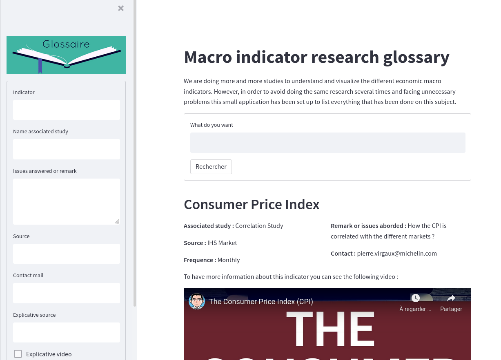

# Glossary

This small project is an application to handle Streamlit and Firebase. It is a glossary to present several macro-indicators. The site can be consulted at the following address :
https://share.streamlit.io/sonicpierre/glossary/main/app.py

It may take a few minutes for the application to launch if it needs to be restarted.
